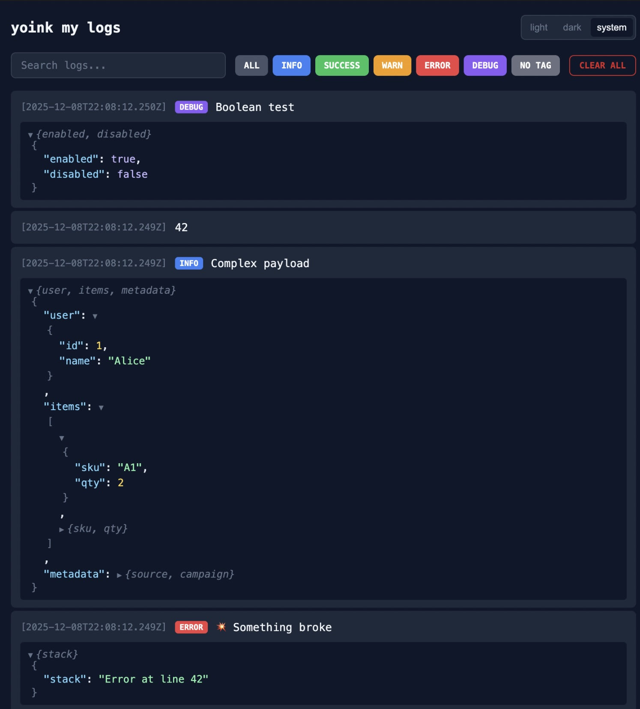
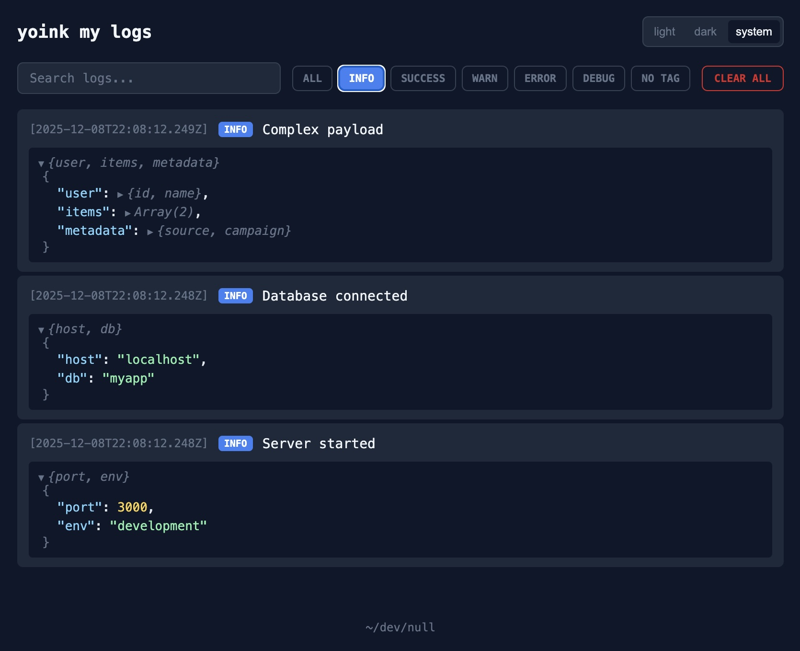
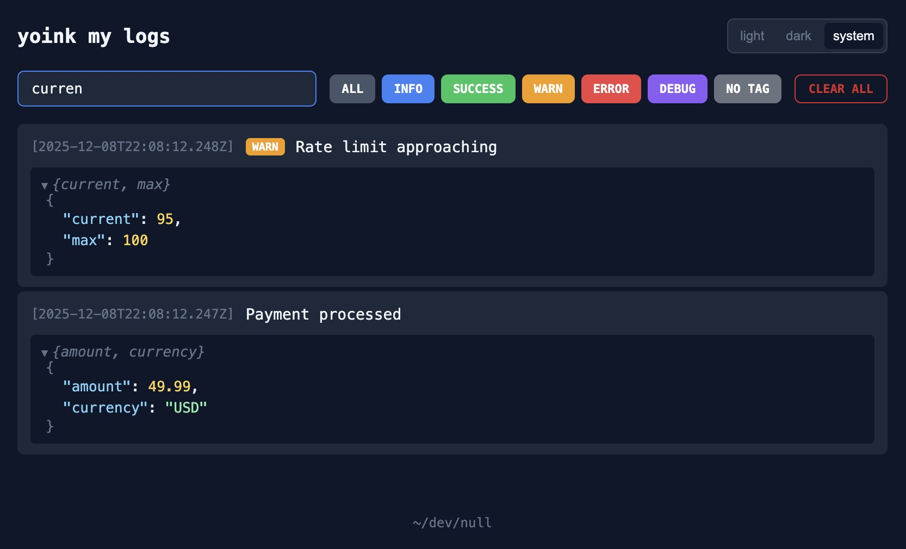
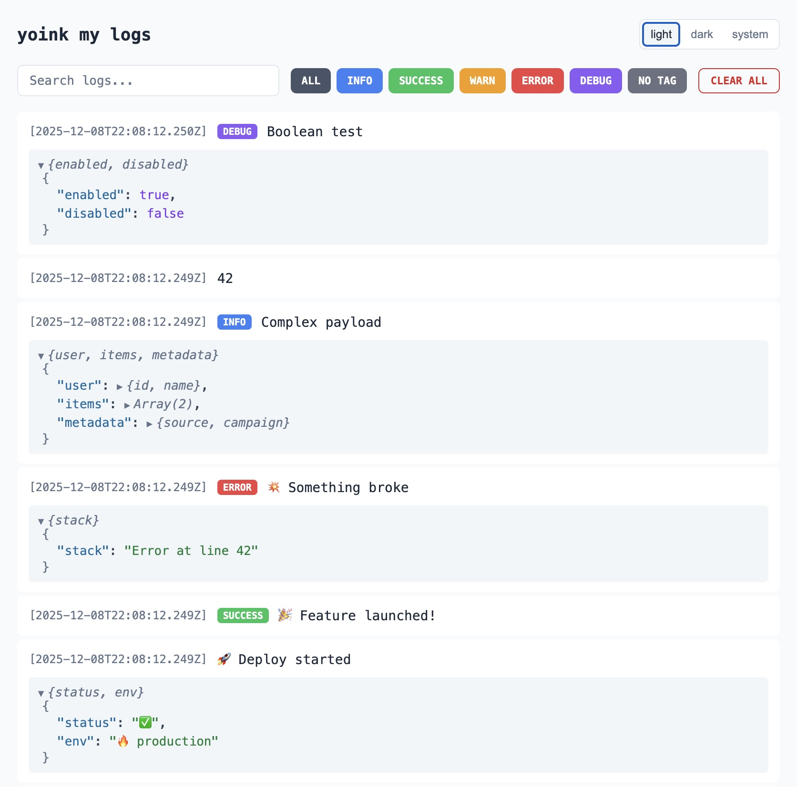

# yoink-my-logs

A better `console.log` for debugging. Zero dependencies. Drop `yoink()` calls anywhere in your code, Node.js or browser, and watch them stream live to a clean web UI with filtering, search, and proper JSON formatting.



<details>
<summary>More screenshots</summary>

## Filter by Tag



## Search



## Light Theme



</details>

## Installation

```bash
npm install yoink-my-logs
```

## Usage

### 1. Add logs to your code

```javascript
import yoink from "yoink-my-logs"

// Log data directly
yoink({ userId: 123, cart: items, total: 49.99 })

// Data with a message (data first, message second)
yoink({ userId: 123 }, "User signed in")

// With tags for different log levels
yoink.info({ port: 3000 }, "Server started")
yoink.success({ amount: 49.99 }, "Payment processed")
yoink.warn({ current: 95 }, "Rate limit approaching")
yoink.error({ code: "ETIMEDOUT" }, "Connection failed")
yoink.debug({ requestBody: data })  // data-only works with tags too
```

### 2. Start the viewer

```bash
npx yoink
```

Open [http://localhost:7337](http://localhost:7337) to see your logs stream in real-time.

## Browser / Frontend Usage

You can also call `yoink()` from your frontend code. Logs are sent to the yoink server via HTTP.

### Option A: ES Module Import

```javascript
import yoink from "yoink-my-logs/browser"

yoink({ url: location.href, user: currentUser })        // data only
yoink({ url: location.href }, "page loaded")            // data + message
yoink.info({ type: "click" }, "user action")
```

### Option B: Script Tag

Add the script tag to your HTML (served by the yoink server):

```html
<script src="http://localhost:7337/yoink.js"></script>
<script>
  yoink({ id: "submit" }, "button clicked")
  yoink.error({ code: 500 }, "something broke")
</script>
```

### Custom Port or Host

If the yoink server is running on a non-default port or a different host:

```javascript
import yoink from "yoink-my-logs/browser"

// Custom port
yoink.init({ port: 8080 })

// Custom host (e.g., for LAN access from mobile)
yoink.init({ host: "192.168.1.50" })

// Both
yoink.init({ host: "192.168.1.50", port: 8080 })

yoink("hello from mobile")
```

The `init()` call is optional — if you don't call it, it defaults to `localhost:7337`.

## How It Works

- Logs are stored in `~/.yoink-my-logs/` as daily JSON files (`YYYY-MM-DD.log`)
- The browser UI connects via Server-Sent Events (SSE) for live updates
- When you open the viewer, it shows today's log history and streams new entries as they arrive
- File rotation: When a log file exceeds 100MB, a new file is created (`YYYY-MM-DD_2.log`, `YYYY-MM-DD_3.log`, etc.)
- Entry limit: Individual log entries larger than 100KB are rejected to prevent runaway logging

## Configuration

### Environment Variables

| Variable | Default | Description |
|----------|---------|-------------|
| `YOINK_PORT` | `7337` | Port for the web UI |
| `YOINK_LOG_DIR` | `~/.yoink-my-logs` | Directory where log files are stored |

### Examples

```bash
# Custom port
YOINK_PORT=8080 npx yoink

# Custom log directory
YOINK_LOG_DIR=/tmp/my-logs npx yoink

# Both
YOINK_PORT=8080 YOINK_LOG_DIR=/var/log/yoink npx yoink
```

Default port is `7337`.

## API

### `yoink(data)` / `yoink(data, message)`

Flexible argument handling:

| Call | Data | Message |
|------|------|---------|
| `yoink({ user: 1 })` | `{ user: 1 }` | `""` |
| `yoink({ id: 1 }, "clicked")` | `{ id: 1 }` | `"clicked"` |
| `yoink("hello")` | `undefined` | `"hello"` |

- **Single non-string argument** → treated as data
- **Single string argument** → treated as message
- **Two arguments** → first is data, second is message

### Tagged methods

All tagged methods accept the same flexible arguments as `yoink()`:

| Method | Tag | Color |
|--------|-----|-------|
| `yoink.info()` | INFO | Blue |
| `yoink.success()` | SUCCESS | Green |
| `yoink.warn()` | WARN | Amber |
| `yoink.error()` | ERROR | Red |
| `yoink.debug()` | DEBUG | Purple |

### Browser module

The browser module (`yoink-my-logs/browser`) has the same API as above, plus:

#### `yoink.init(options?)`

| Option | Type | Default | Description |
|--------|------|---------|-------------|
| `host` | `string` | `localhost` | Hostname or IP address of the yoink server |
| `port` | `number` | `7337` | Port number of the yoink server |

## Demo

Generate sample logs to test the UI:

```bash
npm run demo
```

Or after installing the package:

```bash
npx yoink-demo
```

## Development

```bash
npm test
```

## License

MIT
